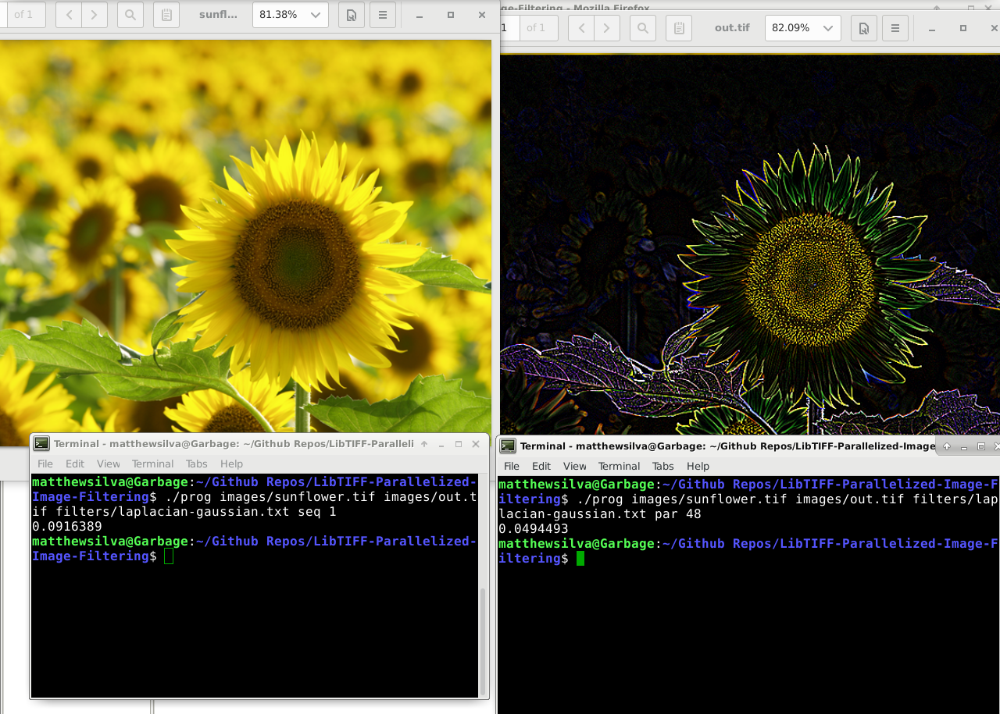
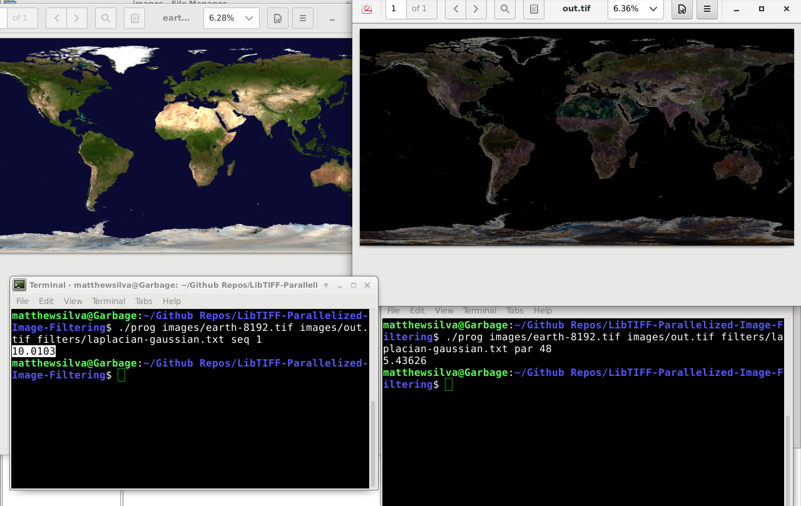
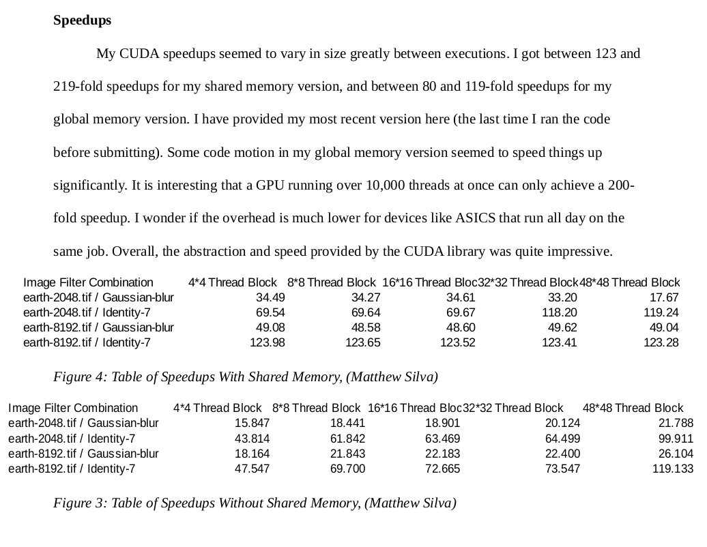
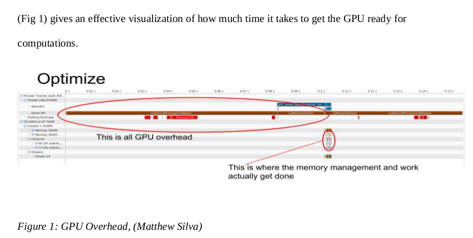
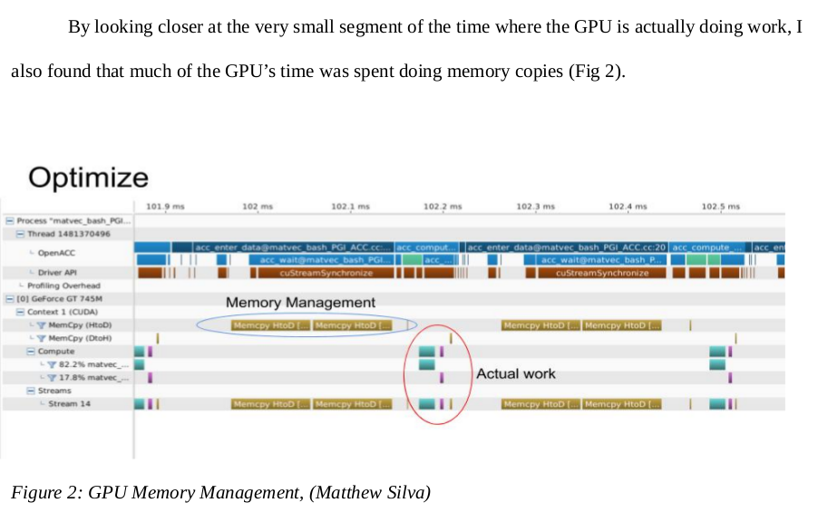

# CUDA-Image-Filtering

# Dependencies / Installation

	Your Nvidia GPU must support CUDA
	
	Compiling CUDA code involves installing all of the Nvidia drivers, which can be found at
	
	https://docs.nvidia.com/cuda/cuda-installation-guide-linux/index.html
	
	The process is fairly involved and takes quite some time
	
	
	Install LibTIFF (On Debian) with
	
	sudo apt install libtiff5-dev
	
	(Find LibTIFF in your distro's package manager to install)
	
# Running the Code

Compile:
	
	
	Compiling the code using the command below must be done on the Nvidia compiler once CUDA and LibTIFF
	have been installed
	
	nvcc conv2d-CUDA-shared-memory.cu -std=c++11 -o prog
	
Run:
	
	The executable should be run according to the following arguments
		
	./filter <in_fname> <out_fname> <filter_fname> <algo>
        <in_fname> = path to the input image
        <out_fname> = path to the output image
        <filter_fname> = path to the filter file
        <algo> = whether to use the sequential (seq) or parallel algorithm (par)
	
	e.g.
	
	./filter images/earth-8192.tif images/out.tif filters/identity-7.txt par
	
	(This also outputs a bunch of performance info in CSV format, which 
	 is available in a much more readable form in the included PDF report)
	 
(The below examples are demos on a local machine of what the program does, but do not utilize CUDA because
 I currently do not have access to the HPC cluster that I ran this code on or a local machine with an NVIDIA GPU)

The speedup chart in the Deliverables section below shows the speedups when running on an HPC cluster

# Deliverables

See the PDF Report for a full explanation of how the filtering operations were parallelized using CUDA. The CUDA library
offered a very large and useful set of abstractions for parallelizing code quickly and making it very fast very easily.

Shared memory between thread blocks ended up being one of the largest speedups over the regular CUDA solution.

Synchronizing code without having any guarantee of execution order outside of a thread block was quite interesting
and made for a challening project.

Further considerations should be made for warp size and other CUDA specifics.

A comparison should also be made to automated parallelism solutions like OpenMP and OpenACC

# OpenACC

I compiled a thorough presentation on OpenACC that references this project.

It can be found inside the repo as 
	
	Matthew_Silva_OpenACC_revised.pptx.pdf